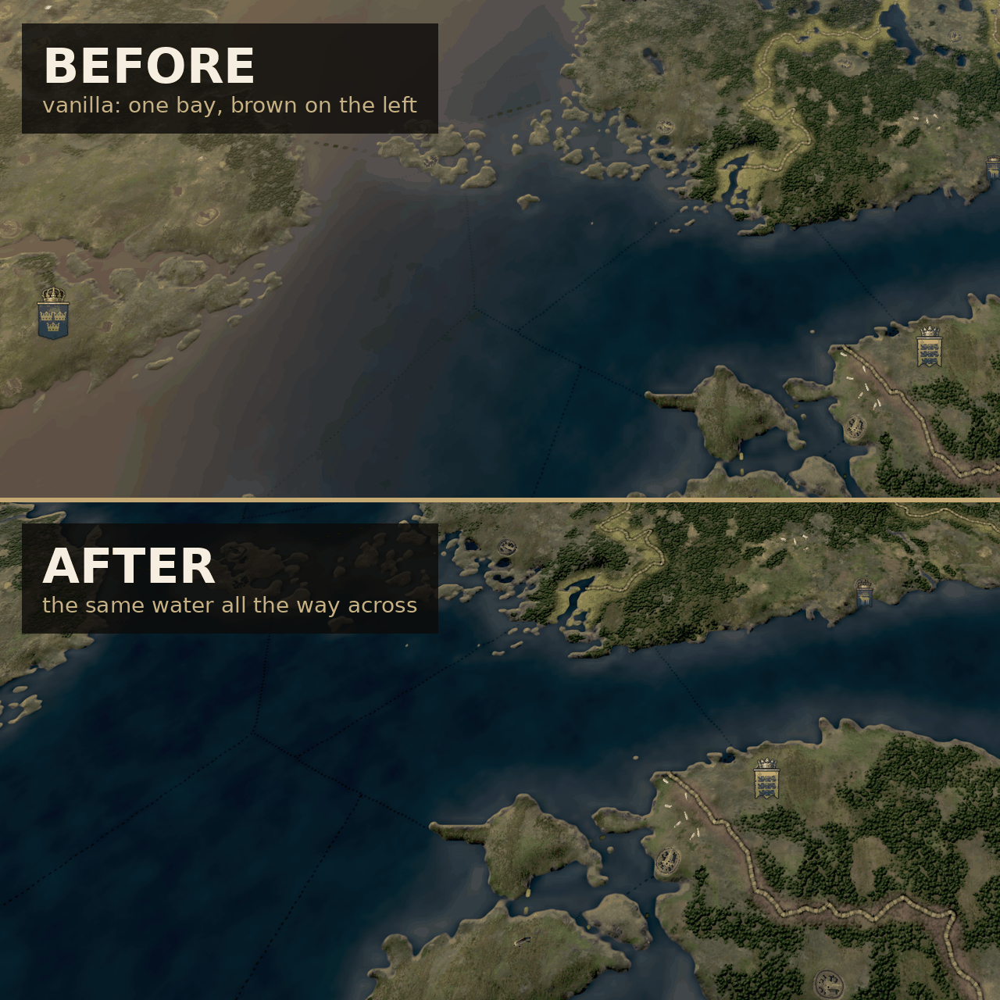

# Ultrawide Fog Tint Fix (CK3)

Removes the warm haze that washes out the left side of the map on ultrawide and
super-ultrawide displays. Ordinary distance fog is left alone.

## Cause

`jomini_fog.fxh` computes the map's distance fog like this:

    Diff      = CameraPosition - WorldSpacePos
    HorizFac  = 1 - abs( normalize( Diff ).y )
    Ramp      = min( ( |Diff|^2 - fog_begin^2 ) / ( fog_end^2 - fog_begin^2 ), fog_max )
    FogFactor = saturate( Ramp * HorizFac ) * zoom fade * ( 1 - height fade ) * noise
    FogColour = fog_color + smoothstep( CamX + rel_begin, CamX - rel_end, WorldX ) * relative_fog_color
    Pixel     = lerp( Pixel, FogColour, FogFactor )

`HorizFac` is what makes this an ultrawide problem. Looking down at the middle of
the screen, the vector from camera to terrain is mostly vertical, so the factor is
near zero and there is no fog. Towards the left and right edges that vector becomes
nearly horizontal and the factor approaches one. Fog is, in effect, "the edges of
the screen" - and a 32:9 screen is mostly edges.

On top of that every distance in the formula is tuned for how far a 16:9 screen
reaches. `fog_end = 500` sets where the ramp saturates at `fog_max`; a 32:9 screen
sees roughly twice as far sideways, so its outer thirds sit at full `fog_max`
permanently.

The vanilla values, identical in all five files this mod overrides:

    fog_color = hex{ 50779b }      # blue-grey
    fog_begin = 20
    fog_end   = 500
    fog_max   = 0.2                # cap: at most 20% blend toward the fog colour

    relative_fog_color = { 0.6 0.2 -0.2 }
    relative_fog_begin = 100.0
    relative_fog_end   = 400.0

`relative_fog_color` is a second, *asymmetric* layer: its blend factor depends only
on how far left of the camera a pixel is, over a 500 unit window. It adds red and
green and subtracts blue, so the left side of the map is washed warm and pale while
the same terrain in the centre looks normal. That is the part that turns northern
conifers white.

Removing only that warm layer is not enough - it leaves the blue `fog_color` haze,
which is the wash that covers the whole map regardless of what is drawn on it.

## Presets

Because this is data and not a shader, switching presets needs no recompile - just
re-run the installer and restart:

    tools/apply_preset.py off
    ./install.sh

| preset | fog_max | fog_end | relative tint | what it does |
| --- | --- | --- | --- | --- |
| `vanilla` | 0.2 | 500 | warm, 100/400 | byte-identical to the base game, for A/B |
| `scaled` | 0.2 | 1000 | warm, 200/800 | every distance doubled for 32:9 / 16:9 = 2, so a given screen position gets the haze a 16:9 player sees there |
| `neutral` | 0.2 | 1000 | none | as `scaled`, minus the asymmetric warm tint |
| `soft` | 0.08 | 1000 | none | as `neutral`, strength cap cut from 20% to 8% |
| `off` | 0.0 | 500 | none | no distance fog at all |

The mod currently ships the **`off`** preset: `fog_max = 0` zeroes the ramp, so
nothing is blended anywhere. That is the decisive test - if the wash is still there
with this installed, distance fog is not what you are looking at and the next
suspect is the flatmap blend at wide zoom.

Once fog is confirmed as the cause, `soft` or `scaled` are the ones to live with;
`off` removes all sense of depth on the map.

`apply_preset.py` rebuilds the files from the vanilla ones in the Steam install, so
it also picks up any unrelated change Paradox makes to them.

## Layout

    descriptor.mod                       mod metadata
    thumbnail.png                        preview image, must sit in the mod root
    gfx/map/environment/*.txt            five environment files, generated
    tools/apply_preset.py                rebuilds those from vanilla with a preset
    tools/make_thumbnail.py              rebuilds thumbnail.png from two screenshots
    install.sh                           copies the mod into the Proton prefix
    steam-workshop/                      Workshop and Paradox Mods listing texts

## Installing

Run `./install.sh`, then enable "Ultrawide Fog Tint Fix" in the launcher playset.
No shader is touched, so there is no shader recompile and no first-load delay -
and toggling the mod in the playset is a clean A/B test.

## Game version

Built against 1.19.0.6 (Scribe). These files are full overrides, so after a patch
re-diff them against `<steam>/Crusader Kings III/game/gfx/map/environment/`.

## Compatibility

Conflicts with mods that replace the same environment files - map graphics or
lighting overhauls. Load this one below them to keep the fix.
